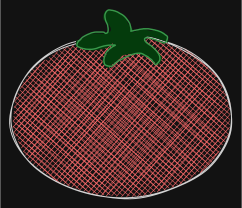

### Dorotui
Aplicativo TUI de Pomodoro feito em [Textual](https://textual.textualize.io/).

Estou estudando o Textual em paralelo ao desenvolvimento, então no momento ele é apenas um Pomodoro comum.

#### O que ele faz?
Além das funcionalidades básicas de um Pomodoro:
- Personalização no tempo da sessão e do descanso;
- Criação de tarefas com quantidade de ciclos pomodoros;
- Visualizar métricas de pomodoros e sessões concluídas e não concluídas (não implementado ainda).

#### Motivação
Decidi desenvolver esse aplicativo porque uso a técnica Pomodoro para tudo, acho muito produtivo e não achei nenhum outro aplicativo que suprisse a minha necessidade. Achei uma boa oportunidade para estudar Python, Textual e também poder desenvolver o meu primeiro TUI.

#### Instalação

Pré-requisitos: Python 3.11+ e [pipx](https://pipx.pypa.io/)

```bash
git clone https://github.com/seu-usuario/doro-tui.git
cd doro-tui
pipx install .
```

#### Uso

```bash
dorotui
```

#### Arquivos de configuração e dados

O doro-tui salva suas configurações e tarefas em locais padrão do sistema operacional:

### Linux
- **Configuração** (`config.toml`): `~/.config/doro-tui/config.toml`
- **Dados/Tarefas** (`tasks.json`): `~/.local/share/doro-tui/tasks.json`

### Windows
- **Configuração** (`config.toml`): `C:\Users\<usuário>\AppData\Local\doro-tui\config.toml`
- **Dados/Tarefas** (`tasks.json`): `C:\Users\<usuário>\AppData\Local\doro-tui\tasks.json`

### macOS
- **Configuração** (`config.toml`): `~/Library/Application Support/doro-tui/config.toml`
- **Dados/Tarefas** (`tasks.json`): `~/Library/Application Support/doro-tui/tasks.json`
